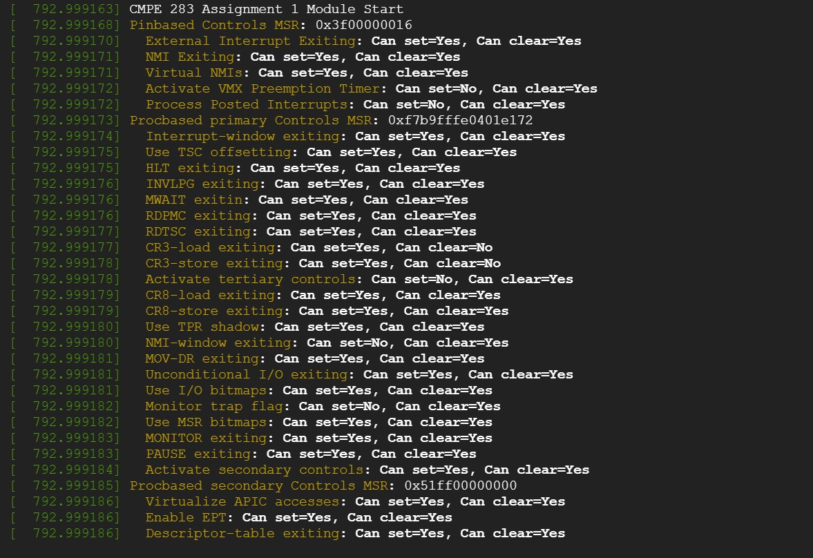
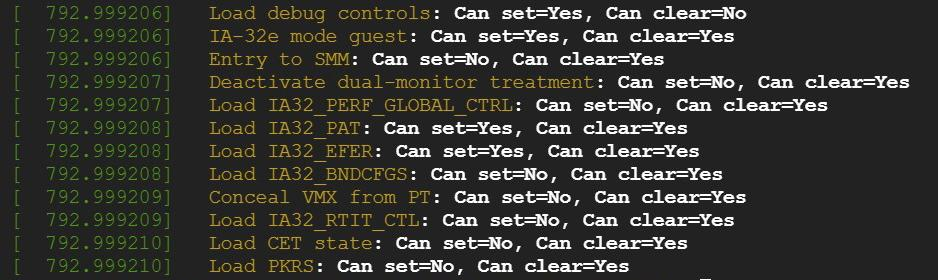

# CMPE-283 - Assignment

1) Create Google cloud platform account and create a new project.

2) Enable "Compute Engine API" for the created project inorder to manage virtual machines.

3) After enabling Compute Engine API, using below command creating virtul machine instance

4) Adding "—enable-nested-virtualization" at the end of the command.

5) After creating instance, using gcloud SSH we can open the instance.

6) After modifying "CMPE283-1.c" file cloning the git repository. After getting into the new instance, cloning the git repository after  modifying "CMPE283-1.c" file.

7) Installing necessary packages in the root user using "app install gcc make" command.

8) Executing the "make" command to create the kernel object.

9) Using "dmesg" command to view the output
 Screenshot 1

Screenshot 2

Screenshot 3

